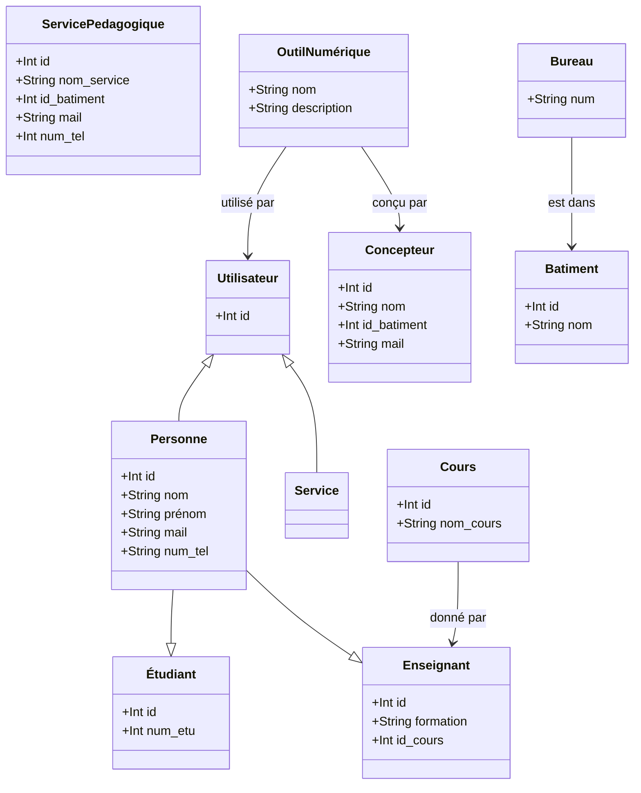

```mermaid

classDiagram
    class Utilisateur
    Utilisateur <|-- Personne
    Utilisateur <|-- Service
    Utilisateur : +Int id

    class Personne
    Personne --|> Étudiant
    Personne --|>Enseignant
    Personne : +Int id
    Personne : +String nom
    Personne : +String prénom
    Personne : +String mail
    Personne : +String num_tel
    
    class Étudiant
    Étudiant : +Int id
    Étudiant : +Int num_etu

    class Enseignant 
    Enseignant : +Int id
    Enseignant : +String formation 
    Enseignant : +Int id_cours

 
    class ServicePedagogique
    ServicePedagogique : +Int id
    ServicePedagogique : +String nom_service
    ServicePedagogique : +Int id_batiment 
    ServicePedagogique : +String mail 
    ServicePedagogique : +Int num_tel 

    class Concepteur
    Concepteur : +Int id
    Concepteur : +String nom
    Concepteur : +Int id_batiment
    Concepteur : +String mail 
    
    class OutilNumérique 
    OutilNumérique --> Utilisateur : utilisé par
    OutilNumérique --> Concepteur: conçu par
    OutilNumérique : +String nom
    OutilNumérique : +String description

    class Cours
    Cours : +Int id
    Cours : +String nom_cours

    class Batiment
    Batiment : +Int id
    Batiment : +String nom

    class Bureau
    Bureau --> Batiment : est dans
    Bureau : +String num

    Cours --> Enseignant : donné par

 
```

