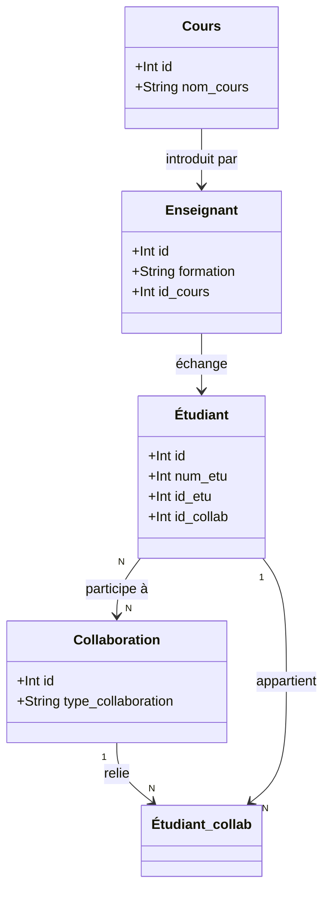

```mermaid

classDiagram
    
    class Étudiant
    Étudiant : +Int id
    Étudiant : +Int num_etu

    class Enseignant 
    Enseignant : +Int id
    Enseignant : +String formation 
    Enseignant : +Int id_cours

    class Cours
    Cours : +Int id
    Cours : +String nom_cours


    class Collaboration 
    Collaboration : +Int id
    Collaboration : +String type_collaboration

    class Étudiant_collab
    Étudiant : +Int id_etu
    Étudiant : +Int id_collab

    Cours --> Enseignant : introduit par 
    Enseignant --> Étudiant : échange
    Étudiant "N" --> "N" Collaboration : participe à
    Collaboration "1" --> "N" Étudiant_collab : relie
    Étudiant "1" --> "N" Étudiant_collab : appartient

```
