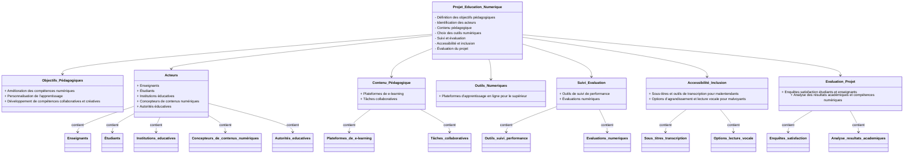

```mermaid
classDiagram
    class Projet_Education_Numerique {
        - Définition des objectifs pédagogiques
        - Identification des acteurs
        - Contenu pédagogique
        - Choix des outils numériques
        - Suivi et évaluation
        - Accessibilité et inclusion
        - Évaluation du projet
    }

    class Objectifs_Pédagogiques {
        + Amélioration des compétences numériques
        + Personnalisation de l'apprentissage
        + Développement de compétences collaboratives et créatives
    }

    class Acteurs {
        + Enseignants
        + Étudiants
        + Institutions éducatives
        + Concepteurs de contenus numériques
        + Autorités éducatives
    }

    class Contenu_Pédagogique {
        + Plateformes de e-learning
        + Tâches collaboratives
    }

    class Outils_Numeriques {
        + Plateformes d'apprentissage en ligne pour le supérieur
    }

    class Suivi_Evaluation {
        + Outils de suivi de performance
        + Évaluations numériques
    }

    class Accessibilité_Inclusion {
        + Sous-titres et outils de transcription pour malentendants
        + Options d’agrandissement et lecture vocale pour malvoyants
    }

    class Evaluation_Projet {
        + Enquêtes satisfaction étudiants et enseignants
        + Analyse des résultats académiques et compétences numériques
    }

    Projet_Education_Numerique --> Objectifs_Pédagogiques
    Projet_Education_Numerique --> Acteurs
    Projet_Education_Numerique --> Contenu_Pédagogique
    Projet_Education_Numerique --> Outils_Numeriques
    Projet_Education_Numerique --> Suivi_Evaluation
    Projet_Education_Numerique --> Accessibilité_Inclusion
    Projet_Education_Numerique --> Evaluation_Projet

    Acteurs --> Enseignants : contient
    Acteurs --> Étudiants : contient
    Acteurs --> Institutions_educatives : contient
    Acteurs --> Concepteurs_de_contenus_numériques : contient
    Acteurs --> Autorités_educatives : contient

    Contenu_Pédagogique --> Plateformes_de_e-learning : contient
    Contenu_Pédagogique --> Tâches_collaboratives : contient

    Suivi_Evaluation --> Outils_suivi_performance : contient
    Suivi_Evaluation --> Evaluations_numeriques : contient

    Accessibilité_Inclusion --> Sous_titres_transcription : contient
    Accessibilité_Inclusion --> Options_lecture_vocale : contient

    Evaluation_Projet --> Enquêtes_satisfaction : contient
    Evaluation_Projet --> Analyse_resultats_academiques : contient
```
