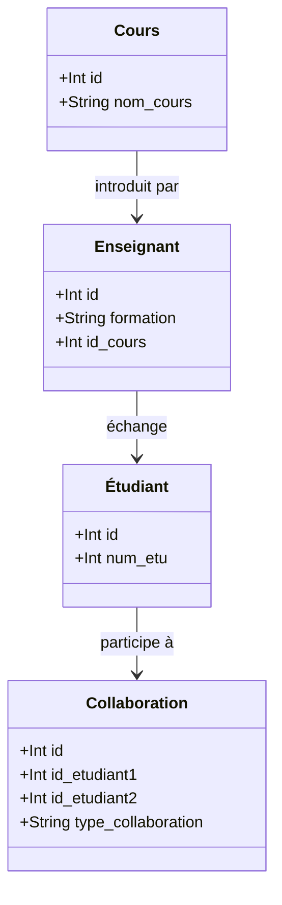

```mermaid

classDiagram
    
    class Étudiant
    Étudiant : +Int id
    Étudiant : +Int num_etu

    class Enseignant 
    Enseignant : +Int id
    Enseignant : +String formation 
    Enseignant : +Int id_cours

    class Cours
    Cours : +Int id
    Cours : +String nom_cours


    class Collaboration 
    Collaboration : +Int id
    Collaboration : +Int id_etudiant1
    Collaboration : +Int id_etudiant2
    Collaboration : +String type_collaboration


    Cours --> Enseignant : introduit par 
    Enseignant --> Étudiant : échange
    Étudiant --> Collaboration  : participe à
```
