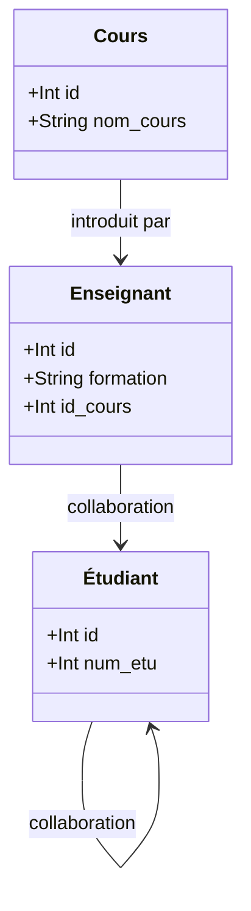

```mermaid

classDiagram
    
    class Étudiant
    Étudiant : +Int id
    Étudiant : +Int num_etu

    class Enseignant 
    Enseignant : +Int id
    Enseignant : +String formation 
    Enseignant : +Int id_cours

    class Cours
    Cours : +Int id
    Cours : +String nom_cours

    Cours --> Enseignant : introduit par 
    Enseignant --> Étudiant : collaboration
    Étudiant --> Étudiant : collaboration

 
```

